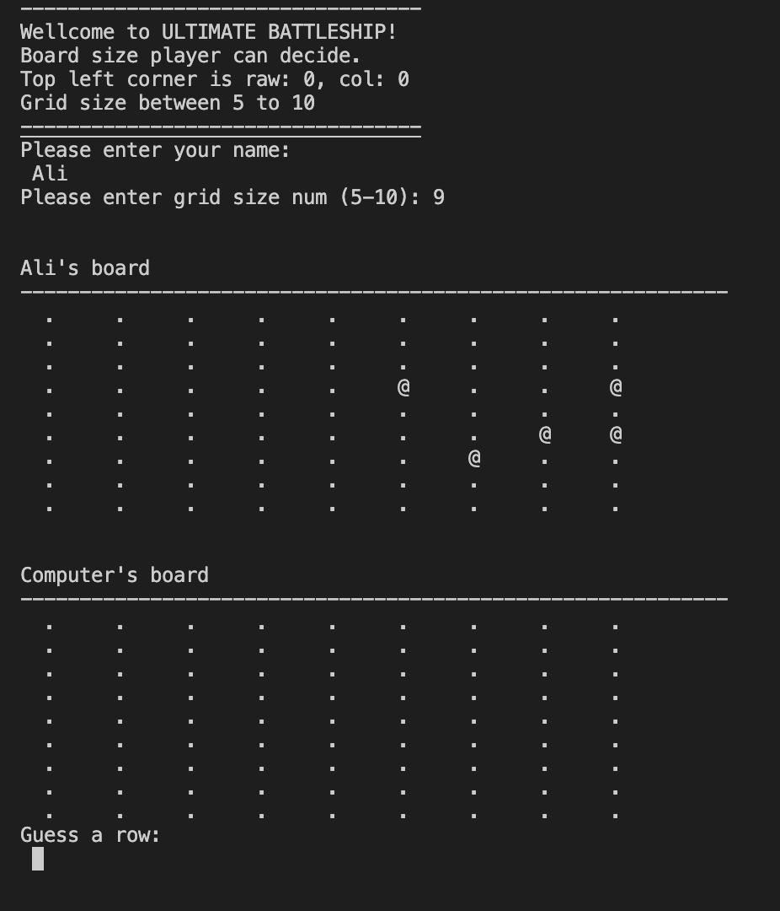
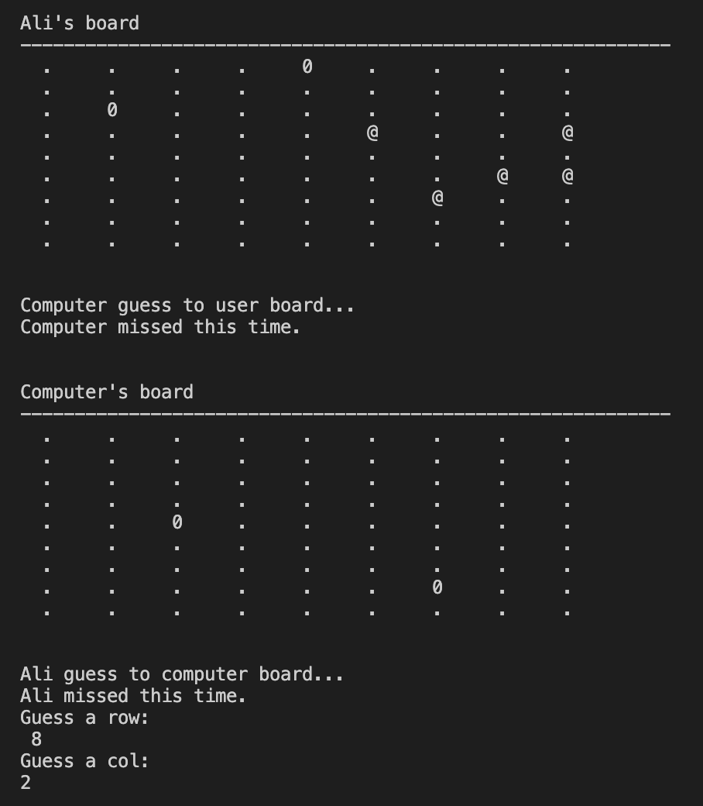
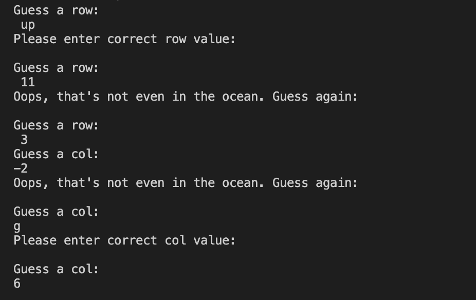

# ULTIMATE Battleships Game

Ultimate Battleships is a Python terminal game, which runs in the Code Institute mock terminal on Heroku

Users can try to guess in the computer board by finding all of the computer's ballteships before the computer finds theirs. Each battleship is @ sign on the board

- Here is the live version of my project

## How to play
Ultimate Battleships is based on the classic pen-and-paper game. You can read more about it on Wikipedia. 
In this version, user enters their name and two boards are rendomly printed.
The player can see where their ships are, shows by an @ sign, but user cannot see where the computer's ships are.
Guesses are marked on the board with an X. Hits are indicated by 0.
User and the computer then take it in turns to make guesses and try to sink each other's battleships.
The winner is who sinks of there battleships first.

## Features

#### Existing Features
    - Random board generation
        - Ships are rendomly placed on both the user and computer boards
        - The user cannot see where the computer's ships are

* User can play against the computer
* Accept user input row and column

* Input validation and error checking
    - User cannot enter coordinate outside the size of the grid
    - User must enter numbers

#### Future Features
- Allow user to select the board size and number of ships 
- Allow user to position ships themeselves

## Testing

I have manually tested this project by doing the following
- Passed the code through a PEP linter and confirmed that there are no problems
- Given incorrect input: strings when numbers are expected, out of bounds inputs
- Tested in my local terminal and the code Institute Heroku Terminal

## Bugs

### Solved Bugs
    - 
    -

## Remaining Bugs
    - No bugs remaining

## Validator Testing
    - PEP8
    * No errors were returned from PEP8online.com

